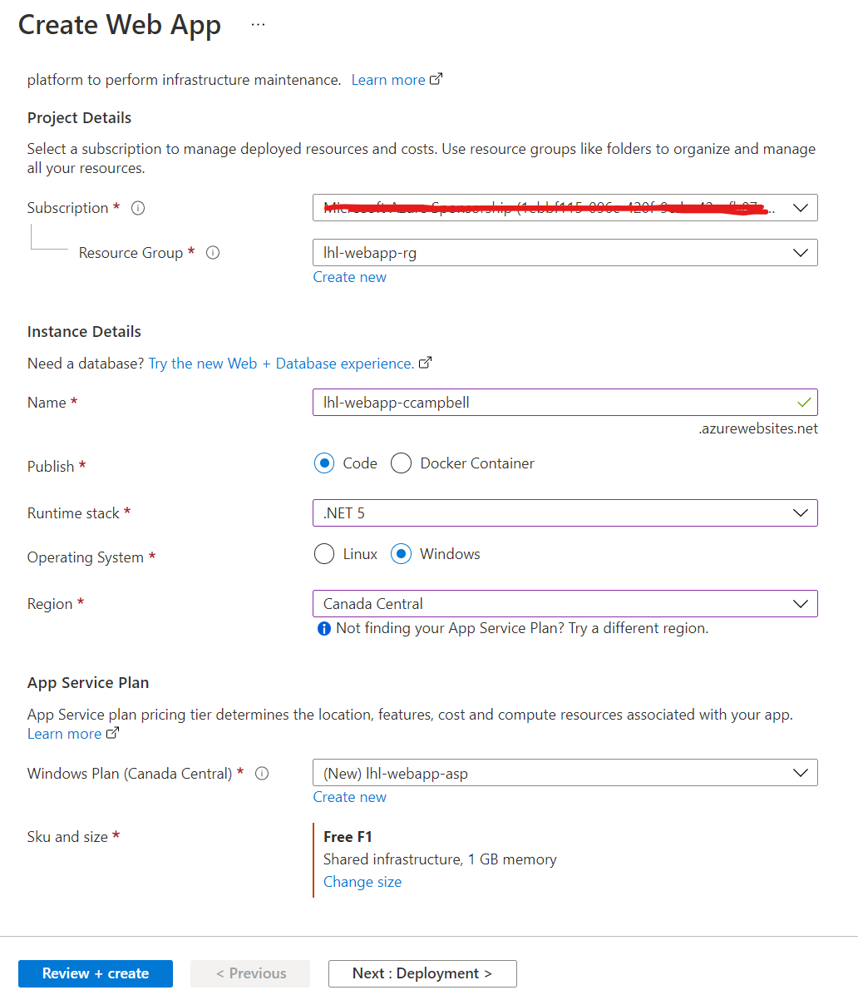

# Lab 01 - Creating an App Service Web App

## Instructions

### Task 1: Open the Azure portal

1. On the taskbar, open up your web browser (Chrome, Microsoft Edge, Firefox, etc).

1. In the open browser window, go to the Azure portal (https://portal.azure.com).

1. At the sign-in page, enter the email address for your Microsoft account, and then select Next.

1. Enter the password for your Microsoft account, and then select Sign in.

    > Note: If this is your first time signing in to the Azure portal, a dialog box will display offering a tour of the portal. Select Get Started to skip the tour and begin using the portal.

### Task 2: Create Web App

1. In the Azure portal's navigation pane, select All services and then Create a resource:

    

1. Search for Web App in the seaech box, then select Create:

    

1. From the Create Web App blade, find the tabs from the blade, such as Basics.

    > Note: Each tab represents a step in the workflow to create a new web app. You can select Review + Create at any time to skip the remaining tabs.

1. From the **Basics** tab, perform the following actions::
    
    1. Leave the **Subscription** text box set to its default value.

    1. In the **Resource group** section, select **Create new**, enter **lhl-webapp-rg**, and then select **OK**.

    1. In the **Name** text box, enter **lhl-webapp-*[yourname]***.

    1. In the **Publish** section, select **Code**.

    1. In the **Runtime stack** drop-down list, select **.NET 5**.  Alternartively if you want to try another framework other than .NET then select what's most comfortable for you.

    1. In the **Operating System** section, select **Windows**. Alternatively you can choose Linux if you want to try that experience.

    1. In the **Region** list, select the **Canada Central** region.

    1. In the **Windows Plan (Canada Central)** section, select **Create new**, enter the value **lhl-webapp-asp** and then click **OK**.    

    1. In the **Sku and size**, click on **Change size** and select **Dev Test** and choose the **Free F1** box, then click **Apply**.

        

    1. Please review that you have something like the following:

        

1. From the **Deployment** tab, perform the following 
actions:
    
    1. For **Continuous deployment**, make sure **Disable** is selected. 

        
    
    1. Click on **Next: Monitoring**.

1. From the **Monitoring**, perform the following actions:

    1. In the **Enable Application Insights** section, select **No**.

        

    1. Select **Review + Create**.    

1. From the **Review + Create** tab, review the options that you selected during the previous steps.

    

1. Select **Create** to create the web app by using your specified configuration. Wait for the creation task to complete before you move forward with this lab.

### Verify your webb app

1. When the deployment is finished click on **Go to resource**.

1. In the **Overview** section, take note of the URL associated with your web app. Click it so you navigate to the application.

    

1. Congratulations you've completed this lab and create a Web App resource. You can move on to the next Lab where we will create our ASP.NET web application and deployment it to your created Web App resource.

## Resources

- [Azure App Service documentation](https://docs.microsoft.com/en-us/azure/app-service/)