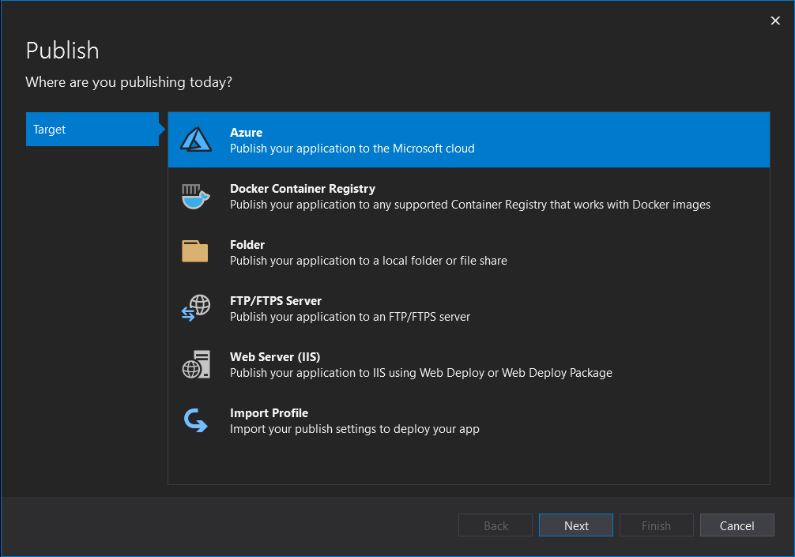
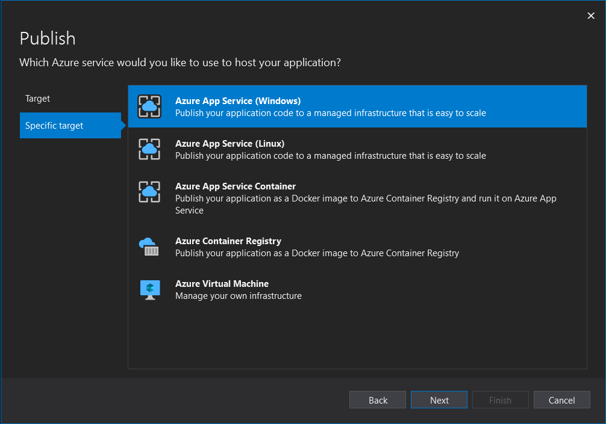

# Lab 02 - Creating an ASP.NET Web App and Deploying to your App Service Web App

## Prerequisites

- An Azure account with an active subscription. [Create an account for free](https://azure.microsoft.com/free/dotnet).
- [Visual Studio 2019](https://www.visualstudio.com/downloads)  with the **ASP.NET and web development** workload.

    If you've already installed Visual Studio 2019:

    - Install the latest updates in Visual Studio by selecting **Help** > **Check for Updates**.
    - Add the workload by selecting **Tools** > **Get Tools and Features**.

- [Install the latest .NET 5.0 SDK.](https://dotnet.microsoft.com/download/dotnet/5.0)
    
## Instructions

The following walks you through using Visual Studio 2019 to create your ASP.NET web application and then using the Visual Studio tooling to deploy to Azure. If you would like to use Visual Studio Code or the Command Line interface please click on the quickstart link in the **Resources** section then then choose the appropriate environment from the quickstart documentation.

### Task 1: Create your ASP.NET Web Application

1. Open Visual Studio and then select **Create a new project**.    

1. In **Create a new project**, find, and choose **ASP.NET Core Web App**, then select **Next**.

    

1. In **Configure your new project**, name the application _LightHouseLabsWebApp_, and then select **Next**.
image

    

1. Select **.NET Core 5.0 (Current)**.

1. Make sure **Authentication Type** is set to **None**. Select **Create**.

    

1. From the Visual Studio menu, select **Debug** > **Start Without Debugging** to run the web app locally.

    

### Step 2: Publish your ASP.NET Web Application

To publish your web app, you must first create and configure a new App Service that you can publish your app to. If you have not done Lab01 please do that now.

Follow these steps to create your App Service and publish your web app:

1. In **Solution Explorer**, right-click the **MyFirstAzureWebApp** project and select **Publish**.

1. In **Publish**, select **Azure** and then **Next**.

    

1. Your options depend on whether you're signed in to Azure already and whether you have a Visual Studio account linked to an Azure account. Select either **Add an account** or **Sign in** to sign in to your Azure subscription. If you're already signed in, select the account you want.

1. Choose the **Specific target**, in this case **Azure App Service (Windows)** since that is what was setup in Lab01 and then **Next**.
    
    

1. Now select your App Service instances from the list box as shown below:

    

1. Now select **Finish** to close the wizard.

1. In the **Publish** page, select **Publish**. Visual Studio builds, packages, and publishes the app to Azure, and then launches the app in the default browser.

    

    You will now see the status of the web application being deployed:

    

    You will then see the deployed all in your browser:

    

1. Congratulations you've completed this lab and published an ASP.NET web application to your Azure App Service resource. You can move on to the next Lab where we will look at scaling options for your application.

## Resources

- [Azure App Service documentation](https://docs.microsoft.com/en-us/azure/app-service/)
- [Quickstart: Deploy an ASP.NET web app](https://docs.microsoft.com/en-us/azure/app-service/quickstart-dotnetcore)