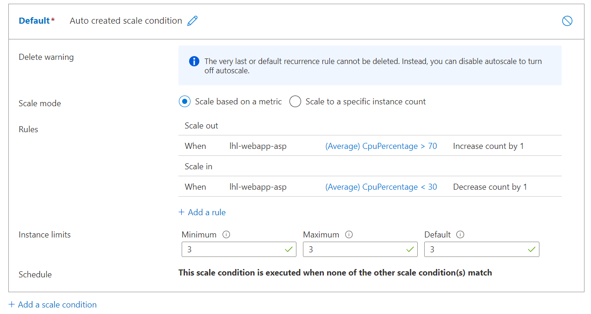

# Lab 03 - Scaling your App Service Web App

## Prerequisites

1. Completed Lab01 and Lab02

## Instructions

### Task 1: Open the Azure portal

1. On the taskbar, open up your web browser (Chrome, Microsoft Edge, Firefox, etc).

1. In the open browser window, go to the Azure portal (https://portal.azure.com).

1. At the sign-in page, enter the email address for your Microsoft account, and then select Next.

1. Enter the password for your Microsoft account, and then select Sign in.

    > Note: If this is your first time signing in to the Azure portal, a dialog box will display offering a tour of the portal. Select Get Started to skip the tour and begin using the portal.

### Task 2: Scaling your app Up

1. Go to your App Service resource. If you don't see it, go to the search box and type in 'app service'. You should then see your resource, then click on it.

1. In the **Settings** section go to **Scale up (App Service plan)** and click on it.

    

1. Change the plan from **Dev / Test** to **Production** and then select **S1**. Then click on **Apply**.

    

1. Your plan will now scale up within a few seconds.

### Task 3: Scaling your app Out

1. In the **Settings** section go to **Scale out (App Service plan)** and click on it.

    

1. In the **Configure** tab choose **Manual scale** and select 3.

    

1. Then click **Save**.

1. Your plan will now scale out to 3 instances within a couple seconds.

### Task 4: Setting up Autoscale

1. In the **Settings** section go to **Scale out (App Service plan)** and click on it.

    

1. In the **Configure** tab choose **Custom scale**. From here we want to configure our **Default** autorule with rules for scaling out and scaling back in.

    

1. Lets define the condidtions for scaling out. Click on the **Add a rule** link:

    1. In the **Metric name** well use **CPU Percentage**.
    
    1. For the **Operator** we'll set the **Metric threshold to trigger scale action** to **70**.

    1. For the **Action Operation** we'll set the **Operation** to **Increase count by** and the **Instance count** to **1**.

    1. The rule should look like so. Click on **Add** to save it:
        
        

1. Lets define the conditions for scaling back in:

    1. In the **Metric name** well use **CPU Percentage**.
    
    1. For the **Operator** we'll set the **Metric threshold to trigger scale action** to **30**.

    1. For the **Action Operation** we'll set the **Operation** to **Decrease count by** and the **Instance count** to **1**.

    1. The rule should look like so. Click on **Add** to save it:
        
        

1. You should then have the following rules setup for scaling out and scaling back in.

    

1. Click on the **Save** button to save your Default autoscale.

1. Congratulations you've completed this lab and manually scaled your ASP.NET web application. We also setup a default profile for Autoscale.

## Resources

- [Azure App Service documentation](https://docs.microsoft.com/en-us/azure/app-service/)

- [Get started with Autoscale in Azure](https://docs.microsoft.com/en-us/azure/azure-monitor/autoscale/autoscale-get-started?WT.mc_id=Portal-Microsoft_Azure_Monitoring)