# Lab 03 - Using Deployment Slots for staging your Web App deployments

## Prerequisites

1. Completed Lab01, Lab02, and Lab03

## Instructions

### Task 1: Open the Azure portal

1. On the taskbar, open up your web browser (Chrome, Microsoft Edge, Firefox, etc).

1. In the open browser window, go to the Azure portal (https://portal.azure.com).

1. At the sign-in page, enter the email address for your Microsoft account, and then select Next.

1. Enter the password for your Microsoft account, and then select Sign in.

    > Note: If this is your first time signing in to the Azure portal, a dialog box will display offering a tour of the portal. Select Get Started to skip the tour and begin using the portal.

### Task 2: Create Deployment Slot

1. Go to your App Service resource. If you don't see it, go to the search box and type in 'app service'. You should then see your resource, then click on it.

1. Go to the **Deployment** section and click on **Deployment slots**.

    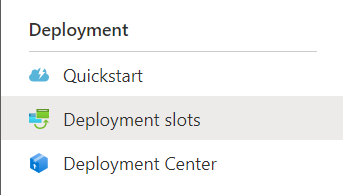

1. Click on the **Add Slot** button in the top toolbar:

    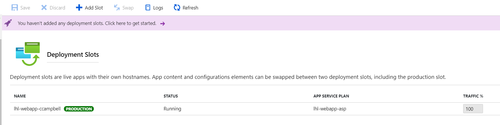

1. For the **Name** text box, enter in **Staging** and then change the value for **Clone settings from** to the name of your web app.

    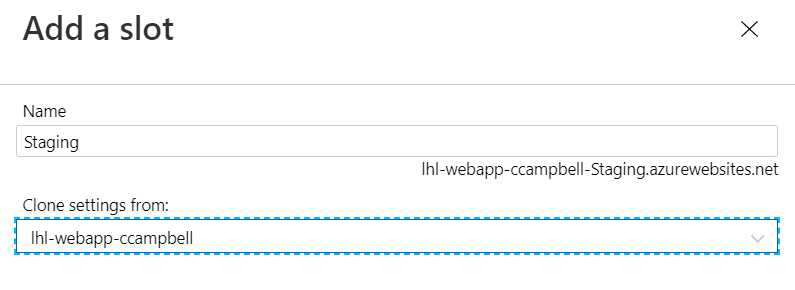

1. Then click on **Add** to complete adding the slot. When you see the message **Successfully created slot 'Staging'**, click on **Close**.

1. You will now have two slots and 100% of the traffic will be going to the **Production** slot. 

### Task 3: Configure your Deployment Slot

1. From the **Deployments Slots** screen, click on the staging slot you created by clicking on the linke **lhl-webapp-staging**.

    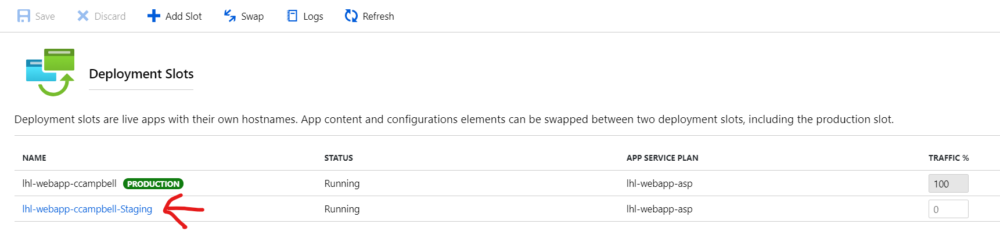

1. This will then take you to your staging slot web app. You will notice the title changed to **Staging (lhl-webapp-ccampbell/Staging)**. From here you can see the URL for your staging web app. The name of the staging slot is postfixed to the web app name. In this case:

    https://lhl-webapp-ccampbell-staging.azurewebsites.net

    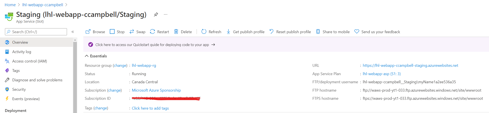

1. Go to the **Configuration** section and we will see the configuration for this deployment slot. Notice all the configurations were copied over from the **Production** slot. 

    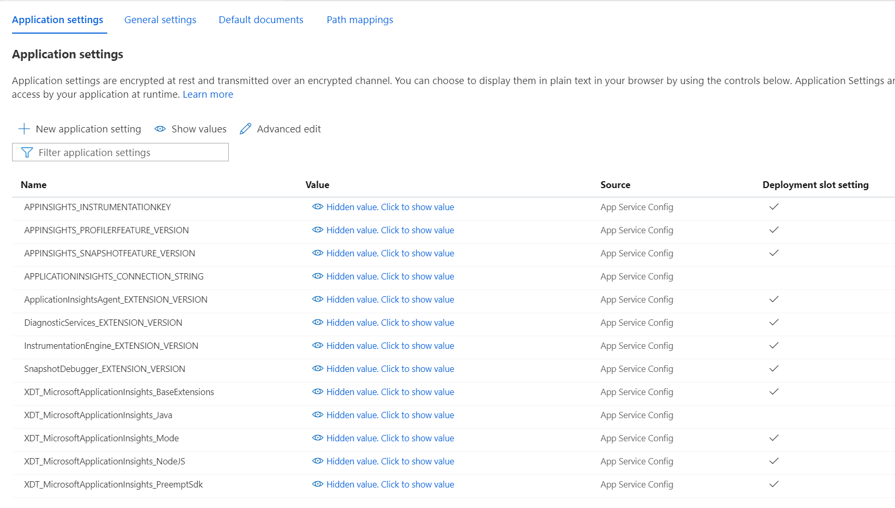

1. Notice the column **Deployment slot setting**. When this is enabled it means this configuration value is specific to this deployment slot. You will want to be mindful of this when you want to change your connection string to **staging** resources for testing.

1. There are a limit on the number of deployment slots you can create depending on the App Service Plan you choose.

1. Another limitation is that your deployment slots dont scale.

### Task 4: Update and deploy your web app to the Deployment Slot

Follow these steps to update and redeploy your web app:

1. Let's go back to the **Overview** section for your staging deployment slot 

    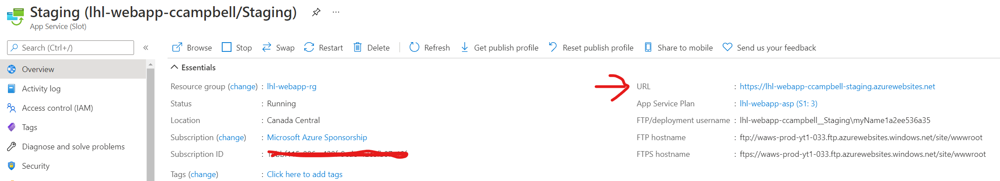

1. Click on the **URL** to open your staging web app in a browser. Notice that its the default landing page and not your deployed web app. Let's make a code change and deploy to the staging slot.

    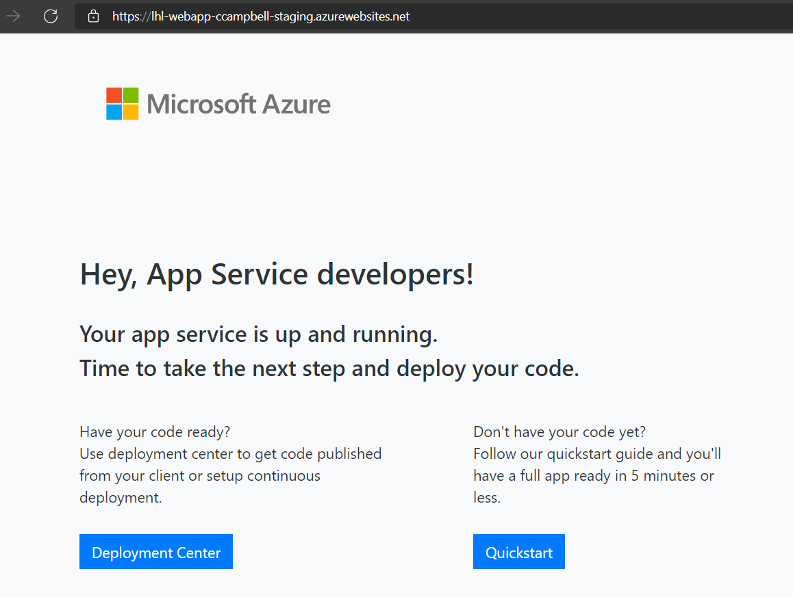

1. Go back to your ASP.NET web application in Visual Studio, in **Solution Explorer**, under your project, open **Index.cshtml**.

1. Let's change line 8 text from `<h1>Welcome</h1>` to `<h1>.NET 💜 Azure</h1>`. Save your changes.

1. To redeploy to Azure, right-click the **LighHouseLabsWebApp** project in **Solution Explorer** and select **Publish**.

1. Click on the **New** button to create a new publish profile for your deployment slot.

    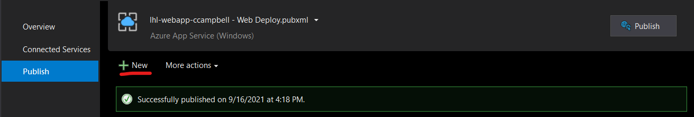

1. In **Publish**, select **Azure** and then **Next**.

    

1. Your options depend on whether you're signed in to Azure already and whether you have a Visual Studio account linked to an Azure account. Select either **Add an account** or **Sign in** to sign in to your Azure subscription. If you're already signed in, select the account you want.

1. Choose the **Specific target**, in this case **Azure App Service (Windows)** since that is what was setup in Lab01 and then **Next**.
    
    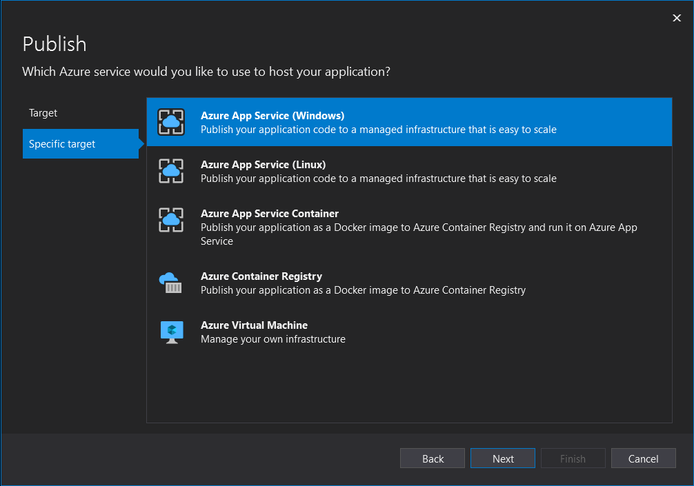

1. Now select your App Service instances from the list box as shown below and expand to the deployment slot instance. Select the staging slot like so:

    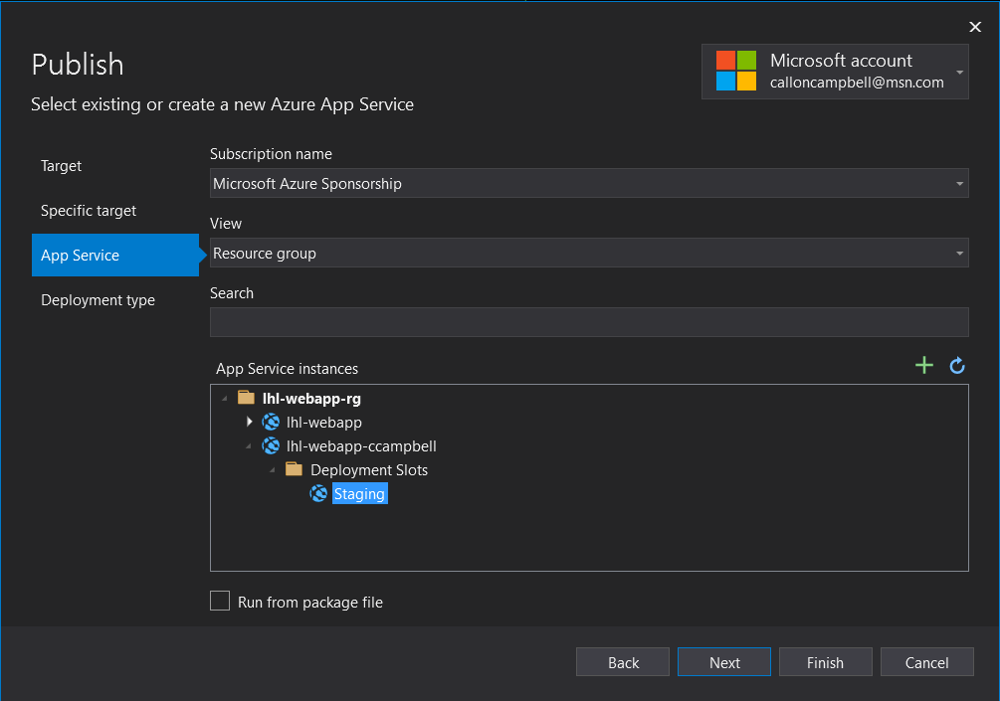

1. Now select **Finish** to close the wizard.

1. In the **Publish** page, select **Publish**. Visual Studio builds, packages, and publishes the app to Azure, and then launches the app in the default browser.

    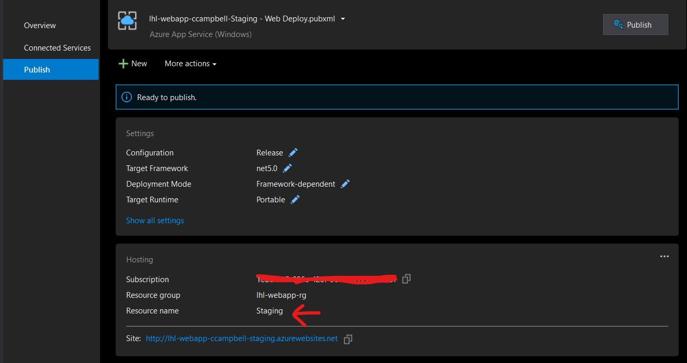

    You will now see the status of the web application being deployed:

    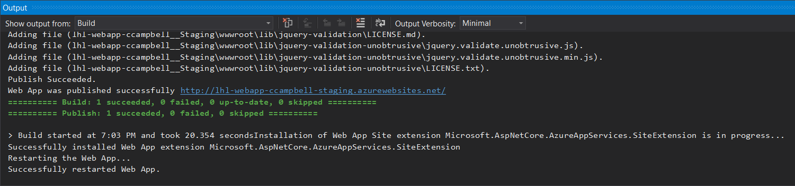

    You will then see the deployed all in your browser:

    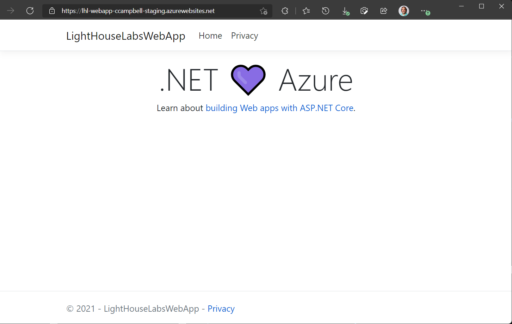

### Task 5: Testing on your Staging slot

1. Once your application is deployed to the staging deployment slot, you can always access it from the staging slot URL.

1. You can also redirect a certain % of your production traffic to the staging slot. Go to your production slot and click the **Deployment** section and click on **Deployment slots**.

    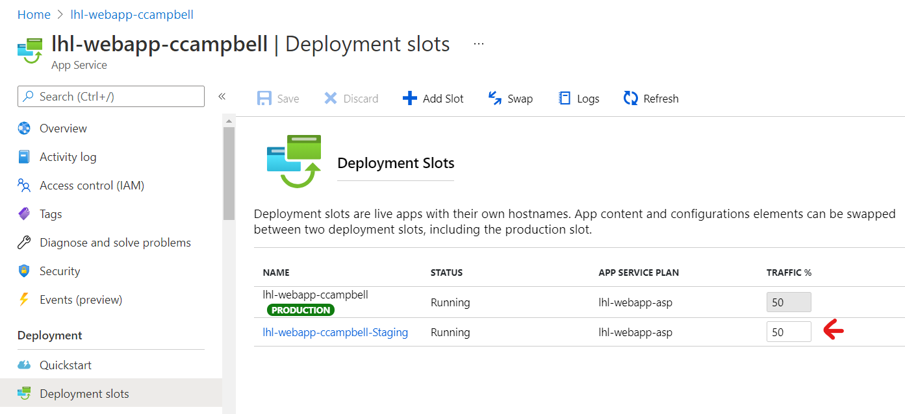

1. Now open up a new browser session (InPrivate) and you should see your staging slot on the production URL like so:

    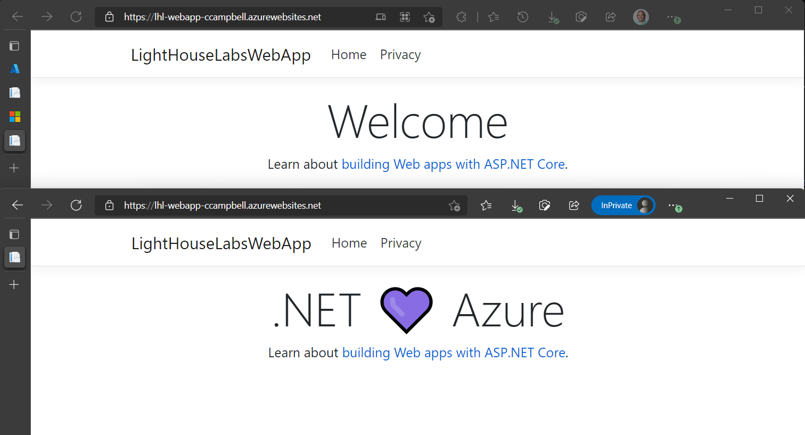

### Task 6: Swap to Production

To swap deployment slots:

1. Go to your app's Deployment slots page and select **Swap**.

    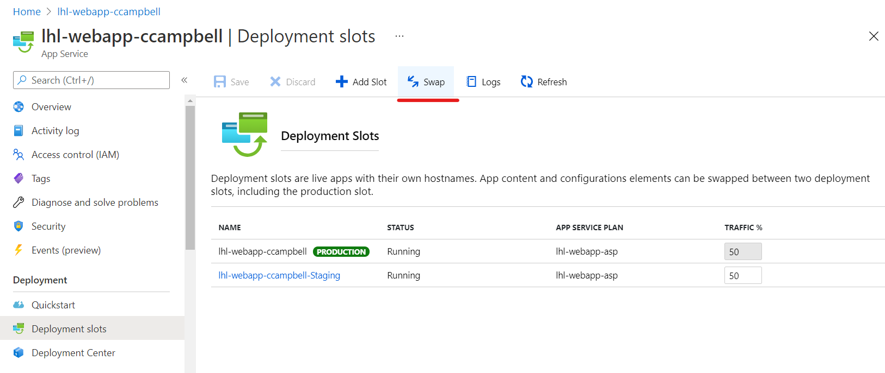

1. Review the configuration changes if any and then click on **Swap**.

    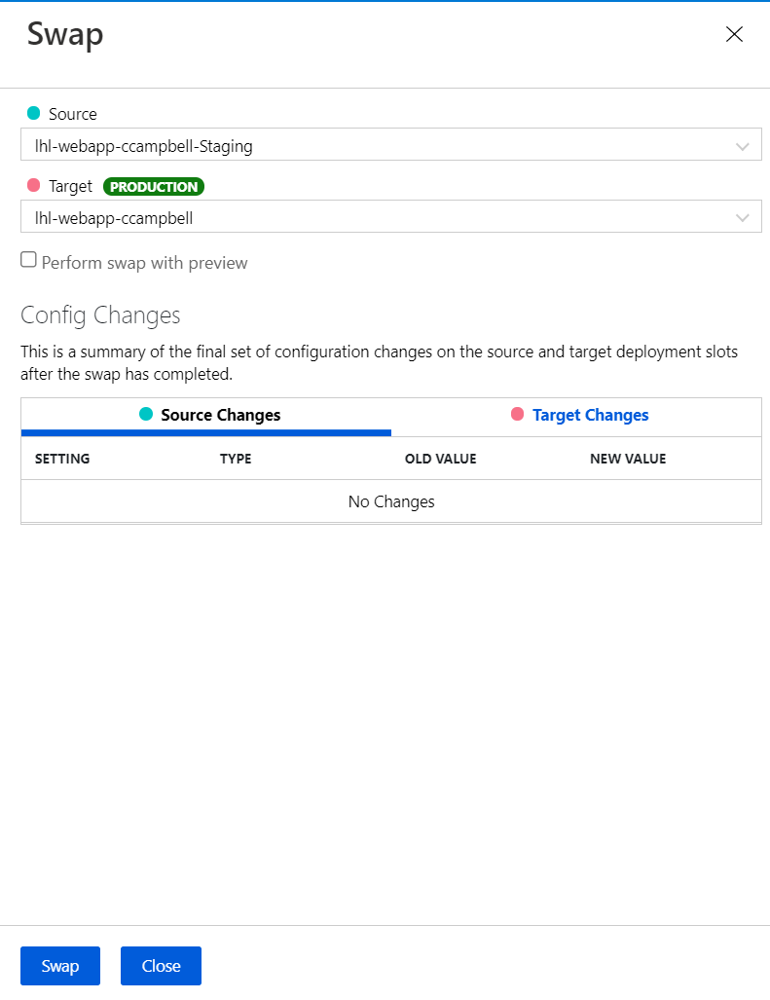

1. When the swap is complete you can click on **Close**.

1. If you're curious about the **Perform swap with preview**, try this out next time. It breaks the swap into two steps and warms up your application. When everything is ready you can complete the swap.

    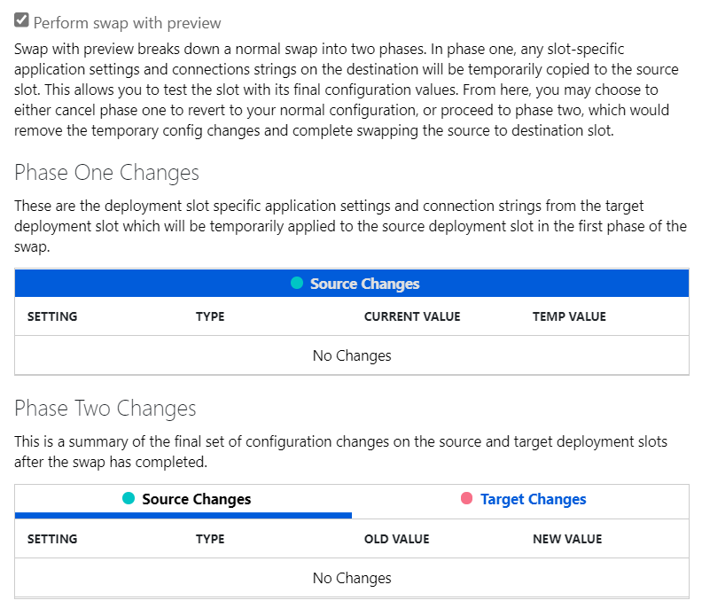

1. Congratulations you've completed this lab and used a deployment slot for staging new changes for your ASP.NET web application. We then swapped to production when ready.

### Task 7: Roll back a swap

If any errors occur in the target slot (for example, the production slot) after a slot swap, restore the slots to their pre-swap states by swapping the same two slots immediately.

## Resources

- [Azure App Service documentation](https://docs.microsoft.com/en-us/azure/app-service/)

- Learn more about [Swap two slots](https://docs.microsoft.com/en-us/azure/app-service/deploy-staging-slots#swap-two-slots)